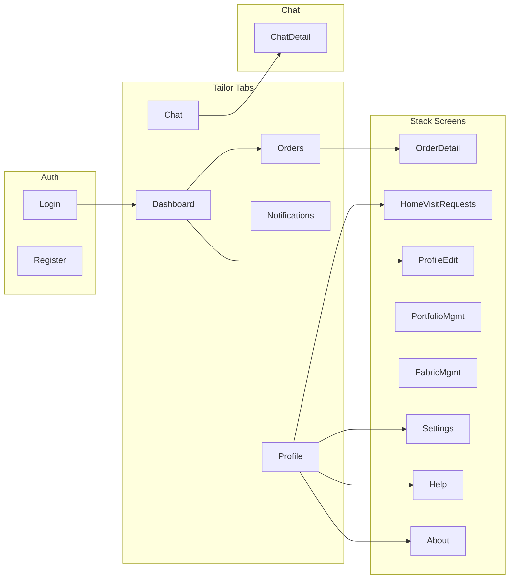

# Tailor Flow: Complete Navigatable Flow and STATUS Tracking

## 1. Role choice: Tailor (fewer screens)

From [.cursor/screens/screensList.txt](.cursor/screens/screensList.txt):

- **Customer flow** includes: Auth, Home, Search, Tailor Profile, Portfolio Gallery, Place Order, Order Confirmation, My Orders, Order Detail, Write Review, Book Home Visit, Chat, Notifications, Profile, Profile Edit, Settings, Help, About — **~18–20 distinct screens**.
- **Tailor flow** includes: Auth, Dashboard, Orders, Order Detail, Chat, Chat detail, Notifications, Profile, Profile Edit, Portfolio Management, Fabric Management, Home Visit Requests, Settings, Help, About — **~16 distinct screens**.

**Tailor has fewer screens**, so the plan targets a **complete navigatable Tailor flow** first.

---

## 2. Current project state

**Tech:** Expo Router (file-based), React Native, Gluestack UI, design tokens (Primary Gold #C9A227, Dark Blue #1D3A5F, Background #F5F6F8). Tabs and Stack layouts exist for both Customer and Tailor; no Drawer yet (spec allows Drawer; keeping it simple with Stack + Profile links).

**Existing routes (Tailor):**

| Route | File | State |

|-------|------|--------|

| Index (splash) | [frontend/app/index.tsx](frontend/app/index.tsx) | Done – auth check, redirect by role |

| Login / Register | [frontend/app/(auth)/login.tsx](frontend/app/\\\\\\\\\\\\\\(auth)/login.tsx), register.tsx | Done |

| (tailor)/(tabs)/dashboard | dashboard.tsx | Done – stats, charts, quick actions, recent orders |

| (tailor)/(tabs)/orders | orders.tsx | **Placeholder** – returns `null` |

| (tailor)/(tabs)/chat | chat.tsx | **Placeholder** – returns `null` |

| (tailor)/(tabs)/notifications | notifications.tsx | **Placeholder** – returns `null` |

| (tailor)/(tabs)/profile | profile.tsx | Done – avatar, name, links to Edit Profile, Portfolio, Fabrics, Logout |

| (tailor)/profile-edit | profile-edit.tsx | Done |

| (tailor)/portfolio-management | portfolio-management.tsx | Done |

| (tailor)/fabric-management | fabric-management.tsx | Done |

| (tailor)/order-detail | — | **Missing** (no file) |

| (tailor)/home-visit-requests | — | **Missing** |

| (tailor)/settings | — | **Missing** |

| (tailor)/help | — | **Missing** |

| (tailor)/about | — | **Missing** |

| Chat detail | — | **Missing** (e.g. `chat/[id].tsx` – spec suggests shared) |

**Navigation wiring:** Dashboard links to Orders, Portfolio Management, Fabric Management, Profile Edit. Profile links to Profile Edit, Portfolio Management, Fabric Management; no links yet to Settings, Help, About, or Home Visit Requests. Tailor layout Stack in [frontend/app/(tailor)/_layout.tsx](frontend/app/\\\\\\\\\\\\\\(tailor)/_layout.tsx) declares only `(tabs)`, `profile-edit`, `portfolio-management`, `fabric-management` — no order-detail, home-visit-requests, settings, help, about.

**Services used:** [frontend/services/auth.ts](frontend/services/auth.ts), [frontend/services/dashboard.ts](frontend/services/dashboard.ts), [frontend/services/portfolio.ts](frontend/services/portfolio.ts), [frontend/services/fabrics.ts](frontend/services/fabrics.ts). No orders or notifications service yet; use **dummy data** for orders, chat, notifications, home visits.

---

## 3. STATUS.md: purpose and format

**Purpose:** Single place to see what is done vs what is left for the Tailor flow, and to drive “one screen at a time” implementation.

**Suggested location:** [frontend/STATUS.md](frontend/STATUS.md) (or project root if you prefer).

**Suggested structure:**

- **Legend:** Done | In progress | Not started
- **Tailor flow screens table:** Screen name, route/file, status, notes (e.g. “dummy data”, “wired from Orders”).
- **Navigation checklist:** All links that must work (e.g. Orders → Order detail, Profile → Settings/Help/About, Dashboard → Home Visit Requests if you add it).
- **Optional:** Short “Next” section (e.g. “Next: Orders tab (list + nav to order-detail)”).

No code in STATUS.md; it’s for tracking only. Update it after each screen is implemented.

---

## 4. Complete Tailor flow (navigatable)

Target: every listed screen exists and is reachable by navigation (tabs, stack, or links from Profile/Dashboard). Use dummy data for orders, chat, notifications, home visits.

**Flow diagram (high level):**

**Screens to implement (in suggested order):**

1. **Orders (tab)** – List of orders (dummy array). Each row/card navigates to `/(tailor)/order-detail?id=<id>`.
2. **Order detail (stack)** – New file `(tailor)/order-detail.tsx`, registered in `(tailor)/_layout.tsx`. Single order by `id` (dummy). Back to Orders.
3. **Notifications (tab)** – List of notifications (dummy). No detail screen required for “complete flow” unless you add it later.
4. **Chat (tab)** – List of conversations (dummy). Each item navigates to chat detail (e.g. `/(tailor)/chat/[id]` or shared `/chat/[id]`).
5. **Chat detail** – New file (e.g. `app/(tailor)/chat/[id].tsx` or `app/chat/[id].tsx`). Dummy messages. Back to Chat list.
6. **Settings** – New file `(tailor)/settings.tsx`, simple options (e.g. theme, notifications toggle). Link from Profile.
7. **Help** – New file `(tailor)/help.tsx`, static text/FAQ. Link from Profile.
8. **About** – New file `(tailor)/about.tsx`, app name/version. Link from Profile.
9. **Home Visit Requests** – New file `(tailor)/home-visit-requests.tsx`, list (dummy). Link from Profile or Dashboard. Register in `(tailor)/_layout.tsx`.

**Layout updates:** In [frontend/app/(tailor)/_layout.tsx](frontend/app/\\\\\\\\\\\\\\(tailor)/_layout.tsx), add `Stack.Screen` for `order-detail`, `home-visit-requests`, `settings`, `help`, `about`. If chat detail lives under `(tailor)`, add a dynamic route (e.g. `chat/[id].tsx `in the `(tailor)` folder and declare it or rely on file-based discovery).

---

## 5. Implementation order (one screen at a time)

| # | Screen | Action | Dummy data |

|---|--------|--------|------------|

| 1 | Orders (tab) | Replace placeholder with list UI; navigate to order-detail on press | Array of 5–10 orders (id, customerName, status, date) |

| 2 | Order detail | Create `order-detail.tsx`, add to layout, accept `id` param | Single order by id from same dummy set |

| 3 | Notifications (tab) | Replace placeholder with list UI | Array of 5–10 notifications (id, title, body, read, date) |

| 4 | Chat (tab) | Replace placeholder with list UI; navigate to chat/[id] | Array of 3–5 conversations (id, name, lastMessage, unread) |

| 5 | Chat detail | Create `chat/[id].tsx` (under tailor or shared), messages list | Dummy messages for given id |

| 6 | Settings | Create `settings.tsx`, add to layout; link from Profile | None (static toggles/labels) |

| 7 | Help | Create `help.tsx`, add to layout; link from Profile | Static text |

| 8 | About | Create `about.tsx`, add to layout; link from Profile | Static text |

| 9 | Home Visit Requests | Create `home-visit-requests.tsx`, add to layout; link from Profile (or Dashboard) | Array of 3–5 requests (id, customer, date, address) |

After each screen: update **STATUS.md** (mark screen Done, note “dummy data” where applicable), then move to the next.

---

## 6. Skills to use

- **Brainstorming** ([.cursor/skills/brainstorming/SKILL.md](.cursor/skills/brainstorming/SKILL.md)): Before implementing each non-trivial screen (e.g. Orders list, Chat UI), briefly align on intent and design (one question at a time, then short design). For very simple screens (About, Help), a one-sentence design is enough.
- **Vercel React Native** ([.cursor/skills/vercel-react-native-skills/SKILL.md](.cursor/skills/vercel-react-native-skills/SKILL.md)): Use for list performance (e.g. FlashList for orders/notifications/chat), Pressable, SafeAreaView/scroll content insets, and styling (StyleSheet / design tokens). Prefer native stack where applicable.
- **Frontend design** ([.cursor/skills/frontend-design/SKILL.md](.cursor/skills/frontend-design/SKILL.md)): Use when building or refining UI (cards, list items, typography, spacing) so screens match the spec (design system in screensList.txt) and look consistent with existing Dashboard/Profile.

---

## 7. Out of scope for this plan

- Real API for orders, chat, notifications, home visits (use dummies only).
- Drawer navigation (optional later; Profile links are enough for “complete flow”).
- Admin or Customer flows.
- Deep linking, badges on tab icons (can be added later without changing this flow).

---

## 8. Deliverables summary

1. **STATUS.md** – Add file, initial table with all Tailor screens and status (Done/Not started), navigation checklist, “Next” line.
2. **Tailor flow screens** – Implement in the order above, one at a time; after each, update STATUS.md and ensure navigation is wired.
3. **Layout** – Register new stack screens in `(tailor)/_layout.tsx` and add Profile (and optionally Dashboard) links to Settings, Help, About, Home Visit Requests.
4. **Consistency** – Use design system (colors, LabeledInputField, GradientButton, VStack, etc.) and dummy data only; no backend calls for orders/chat/notifications/home visits.

This gives you a single, complete navigatable Tailor flow, tracked in STATUS.md and implemented incrementally with dummy data.

---

## Implementation plan: Screen 1 – Orders (tab)

Detailed plan for implementing the first screen in the suggested order: **Orders (tab)** for the Tailor flow.

### Spec summary (from screensList.txt §15)

- **Purpose:** View and filter incoming orders.
- **Layout:** SafeAreaView (#F5F6F8), list with filter tabs at top.
- **Filter tabs:** All, Pending, In Progress, Completed (horizontal ScrollView; active tab #C9A227).
- **Order card:** Order number (bold), customer name (with avatar), order date (gray), status badge, total amount (bold), fabric preview (thumbnail), "View Details" (small, outlined).
- **Actions:** Tap card → Order Detail; pull to refresh; filter tabs update list.
- **Navigation:** Order card → `/(tailor)/order-detail?id=<id>` (order-detail screen will be implemented in step 2).

### What already exists

- **Type:** [frontend/types/dashboard.ts](frontend/types/dashboard.ts) – `RecentOrder`: `id`, `orderNumber`, `customerId`, `customerName`, `customerAvatar?`, `status`, `total`, `createdAt`. Status values: `pending` | `confirmed` | `in_progress` | `completed` | `cancelled`.
- **Component:** [frontend/components/common/RecentOrderCard.tsx](frontend/components/common/RecentOrderCard.tsx) – shows order number, customer name, status badge, date, total; uses `Pressable` and `StatusBadge`; accepts `RecentOrder` and `onPress`. No avatar or fabric thumbnail.
- **Dummy data pattern:** [frontend/services/dashboard.ts](frontend/services/dashboard.ts) – returns `recentOrders` array of 5 items with mixed statuses; uses `RecentOrder` shape and `date-fns` for dates.
- **List patterns:** Dashboard uses `FlatList` from `react-native` with `RefreshControl`, `scrollEnabled={false}` for a small fixed list. Customer home uses `FlatList` with `onEndReached` for infinite scroll. For Orders tab with ~10 items, **FlatList is sufficient** (FlashList optional later).
- **Empty state:** [frontend/components/common/EmptyState.tsx](frontend/components/common/EmptyState.tsx) – icon, title, subtitle, optional action.

### Decisions (keep it simple)

1. **Reuse `RecentOrder` and `RecentOrderCard`** – Use existing type and card. Optionally add a small "View Details" label or keep whole-card press only (spec says "Tap order card" and "View Details" button; minimal approach: card press = navigate; optional later: add explicit "View Details" text/button on card).
2. **Filter tabs** – Four tabs: All, Pending, In Progress, Completed. "All" shows every status including `confirmed` and `cancelled`. Filter in memory over dummy array. Active tab: background or text #C9A227; inactive: gray (#9CA3AF). Use horizontal `ScrollView` + `Pressable` per tab (no new component unless desired).
3. **Dummy data** – Define in the screen file (or a small `frontend/services/orders.ts` mock) an array of 8–10 `RecentOrder` objects with mixed statuses and `createdAt` spread over past days (reuse pattern from dashboard.ts). No API call.
4. **Fabric preview / avatar** – Omit for this pass to keep scope small; card matches Dashboard recent orders. Can add avatar/fabric thumbnail in a later refinement.
5. **Order detail route** – Navigate to `/(tailor)/order-detail?id=${order.id}`. Do **not** create `order-detail.tsx` in this task; that is screen 2. Registering `order-detail` in `(tailor)/_layout.tsx` can be done in step 2 when the screen is added (so no layout change in step 1 if you prefer), or add the Stack.Screen now so the route exists and shows a blank/placeholder until step 2.

### Files to create or modify

| File | Action |

|------|--------|

| [frontend/app/(tailor)/(tabs)/orders.tsx](frontend/app/\\\\\\\\\\\\(tailor)/(tabs)/orders.tsx) | Replace placeholder: add state (orders, filter, refreshing), filter tabs UI, FlatList of RecentOrderCard, dummy data, RefreshControl, onPress → `router.push('/(tailor)/order-detail?id=' + order.id)`, EmptyState when filtered list empty. |

| [frontend/services/orders.ts](frontend/services/orders.ts) | **Optional.** Add `getTailorOrders(): Promise<RecentOrder[]>` returning dummy array (e.g. 8–10 orders). Alternatively, define dummy array inline in orders.tsx. |

| [frontend/app/(tailor)/_layout.tsx](frontend/app/\\\\\\\\\\\\(tailor)/_layout.tsx) | **Optional in step 1.** Add `<Stack.Screen name="order-detail" ... />` so navigating to order-detail doesn’t 404. If omitted, navigation will 404 until step 2. |

### Dummy data shape

Use existing `RecentOrder` from `frontend/types/dashboard.ts`. Example entries (extend to 8–10):

- `id`: `'order-1'`, `'order-2'`, …
- `orderNumber`: `'ORD-001'`, …
- `customerId`: `'customer-1'`, …
- `customerName`: e.g. 'Ahmed Khan', 'Fatima Ali', …
- `status`: mix of `'pending'`, `'confirmed'`, `'in_progress'`, `'completed'`, `'cancelled'`
- `total`: number (e.g. 4500, 6800) – display as PKR in card
- `createdAt`: `Date` or ISO string (use `date-fns` for display)

Can copy/expand the `recentOrders` array from [frontend/services/dashboard.ts](frontend/services/dashboard.ts) (lines 57–95) into the screen or into a new `services/orders.ts` mock.

### Step-by-step implementation

1. **Add dummy orders** – In `orders.tsx` or `services/orders.ts`: define or import an array of 8–10 `RecentOrder` items with mixed statuses and dates.
2. **State** – `orders: RecentOrder[]`, `activeFilter: 'all' | 'pending' | 'in_progress' | 'completed'`, `refreshing: boolean`.
3. **Filter logic** – `filteredOrders = activeFilter === 'all' ? orders : orders.filter(o => o.status === activeFilter)`. For "Pending" tab use `status === 'pending'` (and optionally include `'confirmed'` if you want; spec says "Pending" so map 1:1 to status).
4. **Filter tabs** – Horizontal ScrollView with four Pressables. Label and highlight active (e.g. borderBottomWidth 2 + color #C9A227, or background). On press set `activeFilter`.
5. **List** – SafeAreaView (edges top), VStack or View for filter row, then FlatList with `data={filteredOrders}`, `renderItem` → `RecentOrderCard` with `onPress={() => router.push('/(tailor)/order-detail?id=' + item.id)}`, `keyExtractor={(item) => item.id}`. Add `RefreshControl` (refreshing, onRefresh: set dummy data again or same list).
6. **Empty state** – When `filteredOrders.length === 0`, show EmptyState (e.g. "No orders" / "No orders in this filter") instead of empty list.
7. **Styling** – Background #F5F6F8, card style consistent with RecentOrderCard (white, border #E5E7EB, borderRadius 12). Header area for filter tabs: white or #F5F6F8, padding 16.
8. **Optional** – Register `order-detail` in `(tailor)/_layout.tsx` with a temporary placeholder component so the route exists and back stack works; replace with real Order Detail screen in step 2.

### Acceptance

- Orders tab shows filter tabs (All, Pending, In Progress, Completed) and a list of order cards.
- Tapping a card (or "View Details" if added) navigates to `/(tailor)/order-detail?id=<id>`.
- Pull to refresh updates the list (dummy data can be same).
- Empty filter shows EmptyState.
- Uses design system colors (#C9A227, #1D3A5F, #F5F6F8) and existing RecentOrderCard/StatusBadge.

### After implementation

- Update **STATUS.md**: mark "Orders (tab)" as Done; note "dummy data".
- Next: implement **Order detail (stack)** (create `order-detail.tsx`, register in layout, show single order by id from same dummy set).

---

## Implementation plan: Screen 4 – Chat (tab)

Detailed plan for implementing **Chat (tab)** for the Tailor flow (conversation list only; Chat detail is screen 5).

### Spec summary (from screensList.txt §17 – Chat List Screen)

- **Purpose:** View all conversations with last message preview.
- **Layout:** SafeAreaView (#F5F6F8), FlatList. Empty state if no conversations.
- **Conversation card:** Avatar (circular, 50x50, user image or initials), Name (bold, 16px), Last Message Preview (gray, 14px, truncated), Timestamp (gray, 12px, right-aligned), Unread Badge (red circle with count if unread), Online Indicator (green dot if online).
- **Empty state:** Icon `message-outline`, title "No conversations yet", subtext "Start chatting with tailors/customers".
- **Actions:** Tap conversation → Chat Screen; pull to refresh.
- **Navigation:** Conversation card → Chat Screen (e.g. `/(tailor)/chat/[id]`).

*Out of scope for this pass:* Real-time Socket.io, GET /api/conversations. Use dummy data only.

### What already exists

- **Placeholder:** [frontend/app/(tailor)/(tabs)/chat.tsx](frontend/app/\\\\\\\(tailor)/(tabs)/chat.tsx) – returns `null`.
- **Tab:** Chat tab is already in [frontend/app/(tailor)/(tabs)/_layout.tsx](frontend/app/\\\\\\\(tailor)/(tabs)/_layout.tsx) with icon `message-text` and title "Chat". Badge (unread count) can be added later.
- **EmptyState:** [frontend/components/common/EmptyState.tsx](frontend/components/common/EmptyState.tsx) – icon, title, subtitle; use `icon="message-outline"`.
- **List pattern:** Orders tab uses SafeAreaView (edges top), header with screen title, FlatList, RefreshControl, EmptyState when list empty. Reuse same structure.
- **Design tokens:** #F5F6F8 background, #1D3A5F primary text, #C9A227 accent, #E5E7EB borders, white cards, 12px border radius.
- **Chat detail route:** Not yet implemented. Plan: add stack screen for chat detail in step 5 (e.g. `(tailor)/chat/[id].tsx`). For step 4, navigate to `/(tailor)/chat/<id>`; layout can register the dynamic route in step 5 or we add a minimal placeholder in step 4 so navigation doesn’t 404.

### Decisions (keep it simple)

1. **Conversation type** – Define a small type (e.g. in `frontend/types/chat.ts` or inline in the screen): `id`, `participantName`, `participantAvatar?: string`, `lastMessage`, `updatedAt` (Date or string), `unreadCount` (number). Omit `isOnline` for dummy data or set all false.
2. **Conversation card** – New component `ConversationCard` in `frontend/components/common/ConversationCard.tsx`: avatar (initials if no image), name, last message (truncated), timestamp (relative or format with date-fns), unread badge only if `unreadCount > 0`. Reusable for Customer flow later.
3. **Dummy data** – Array of 3–5 conversations in the screen file or in `frontend/services/chat.ts` (e.g. `getTailorConversations(): Promise<ConversationListItem[]>` returning dummy array). No API.
4. **Chat detail route** – Navigate to `/(tailor)/chat/${conversation.id}`. Chat detail screen and `(tailor)/chat/[id].tsx` are implemented in step 5; in step 4 either add a minimal placeholder stack screen so the route exists, or document that step 5 will add it and accept 404 until then (plan prefers adding a placeholder so back stack works).
5. **Unread badge** – Red circle (#EF4444) with white count; hide when `unreadCount === 0`. Spec: 18x18px minimum.

### Files to create or modify

| File | Action |

|------|--------|

| [frontend/app/(tailor)/(tabs)/chat.tsx](frontend/app/\\\\\\\(tailor)/(tabs)/chat.tsx) | Replace placeholder: state (conversations, refreshing), header "Chat", FlatList of ConversationCard, dummy data, RefreshControl, onPress → `router.push('/(tailor)/chat/' + item.id)`, EmptyState when list empty. |

| [frontend/types/chat.ts](frontend/types/chat.ts) | **New.** Export `ConversationListItem`: `id`, `participantName`, `participantAvatar?`, `lastMessage`, `updatedAt`, `unreadCount`, optional `isOnline`. |

| [frontend/components/common/ConversationCard.tsx](frontend/components/common/ConversationCard.tsx) | **New.** Props: conversation, onPress. Avatar (50x50, initials fallback), name, last message (truncated), timestamp, unread badge. Use Pressable, Card or View, design tokens. |

| [frontend/services/chat.ts](frontend/services/chat.ts) | **Optional.** Add `getTailorConversations(): Promise<ConversationListItem[]>` returning 3–5 dummy items. Alternatively define dummy array inline in chat.tsx. |

| [frontend/app/(tailor)/_layout.tsx](frontend/app/\\\\\\\(tailor)/_layout.tsx) | **Optional in step 4.** If chat detail is under (tailor), Expo Router may auto-discover `(tailor)/chat/[id].tsx `once that file exists (step 5). To avoid 404 in step 4, add a placeholder `chat` group or single screen; or add `Stack.Screen` for a route that matches `/(tailor)/chat/:id` (Expo Router v3: use folder `chat/[id].tsx` under (tailor) in step 5). No layout change strictly required in step 4 if we accept navigating to a not-yet-built screen. |

### Dummy data shape

Use `ConversationListItem`. Example entries (3–5 items):

- `id`: `'conv-1'`, `'conv-2'`, …
- `participantName`: e.g. 'Ahmed Khan', 'Fatima Ali'
- `participantAvatar`: optional (omit for initials)
- `lastMessage`: e.g. 'When can I pick up the suit?', 'Thanks, the fit was perfect'
- `updatedAt`: Date or ISO string (use date-fns for relative or formatted time)
- `unreadCount`: 0, 2, etc. (at least one with unread for badge)
- `isOnline`: optional, e.g. false for all

### Step-by-step implementation

1. **Add type** – Create `frontend/types/chat.ts` with `ConversationListItem` (id, participantName, participantAvatar?, lastMessage, updatedAt, unreadCount, isOnline?).
2. **Add ConversationCard** – Create `frontend/components/common/ConversationCard.tsx`: Pressable card with HStack (avatar left, VStack center for name + lastMessage, right side timestamp + unread badge). Avatar 50x50, border radius 25; initials from first letters of participantName. Truncate lastMessage (e.g. max 40 chars). Timestamp: `formatDistanceToNow` or `format(new Date(updatedAt), 'MMM d')`. Unread badge: red circle, white number, only if unreadCount > 0.
3. **Dummy data** – In `chat.tsx` or `services/chat.ts`: define 3–5 `ConversationListItem` objects with mixed unreadCount and recent updatedAt.
4. **State** – `conversations: ConversationListItem[]`, `refreshing: boolean`. Load dummy data on mount and on refresh.
5. **Screen layout** – SafeAreaView (edges top), background #F5F6F8. Header: white bar, title "Chat" (style consistent with Orders: screenTitle 20px, #1D3A5F).
6. **List** – FlatList with `data={conversations}`, `renderItem` → ConversationCard, `onPress` → `router.push('/(tailor)/chat/' + item.id)`, `keyExtractor={(item) => item.id}`. RefreshControl (refreshing, onRefresh).
7. **Empty state** – When `conversations.length === 0`, show EmptyState (icon "message-outline", title "No conversations yet", subtitle "Start chatting with tailors/customers").
8. **Chat detail route (step 4)** – Either create a minimal `(tailor)/chat/[id].tsx` that shows a placeholder ("Chat detail – id: [id]") and register in layout if needed, or leave for step 5 and document that tap will 404 until then. Prefer minimal placeholder so navigation and back work.

### Acceptance

- Chat tab shows a list of conversation cards (avatar/initials, name, last message, timestamp, unread badge when unread).
- Tapping a card navigates to `/(tailor)/chat/<id>` (placeholder or real screen).
- Pull to refresh reloads the list (dummy data can be same).
- Empty list shows EmptyState with message-outline icon and spec copy.
- Uses design system colors and consistent header/list styling with Orders tab.

### After implementation

- Update **STATUS.md**: mark "Chat (tab)" as Done; note "dummy data".
- Next: implement **Chat detail (stack)** (create `(tailor)/chat/[id].tsx`, show dummy messages, back to Chat list).

---

## Implementation plan: Screen 5 – Chat detail

Detailed plan for implementing **Chat detail** for the Tailor flow. All backend calls are **mocked** (no Socket.io, no real API).

### Spec summary (from screensList.txt §18 – Chat Screen)

- **Purpose:** Real-time messaging with typing indicators and image sharing (for this pass: **text-only, mock only**).
- **Layout:** SafeAreaView (#F5F6F8), inverted FlatList for messages, sticky input bar at bottom, header with user info.
- **Header:** Back button (left), user avatar + name (center), optional online status and more menu (right). Use same top bar pattern as order-detail (back, title, spacer).
- **Message list:** Inverted FlatList. Bubbles: **sent** = right-aligned, gold/gradient (#C9A227); **received** = left-aligned, white. Timestamp (small, gray) below each message. Read receipt (checkmark) optional for mock.
- **Input bar:** TextInput (multi-line, max ~4 lines), Send button (#C9A227, disabled when empty). Image picker out of scope for this pass.
- **Typing indicator:** Optional: static or mock “Customer is typing…” above input; can be omitted for minimal pass.
- **Navigation:** Back → Chat list. No “user profile” navigation for this pass.

**Mocked behaviour (no real BE):**

- **GET /api/conversations/:id/messages** → Mock service returns a fixed list of messages for the given `id` (and optionally participant name/avatar for header).
- **Sending a message** → Add to local state only; no POST /api/messages, no Socket.io.
- **Typing** → Omit or mock with a simple “Other is typing…” that appears for 2s after you focus the input (no socket).

### What already exists

- **Route from Chat tab:** Chat list navigates to `/(tailor)/chat/<id>`. Chat list and types/services may be added in step 4; if not, Chat detail can still define the types and mock data it needs.
- **Order detail pattern:** [frontend/app/(tailor)/order-detail.tsx](frontend/app/\\\\\(tailor)/order-detail.tsx) – `useLocalSearchParams`, custom top bar (back, title, spacer), SafeAreaView, ScrollView. Reuse same top bar structure for Chat detail header.
- **Design tokens:** #F5F6F8 background, #1D3A5F primary text, #C9A227 accent/gold, #E5E7EB borders, white cards, 12px radius. Sent bubble: gold; received: white with border.
- **Expo Router:** File `(tailor)/chat/[id].tsx `gives route `/(tailor)/chat/:id`. No need to register in `_layout.tsx` if file-based discovery picks it up; otherwise add explicit Stack group/screen for `chat/[id]`.

### Decisions (mock-only, keep it simple)

1. **Message type** – In `frontend/types/chat.ts`: `id`, `conversationId`, `senderId` (or `isFromTailor: boolean`), `content`, `createdAt`, optional `readAt?`. For mock, `senderId` vs current user determines sent vs received.
2. **Conversation/participant for header** – Mock `getConversationById(id)` returning `{ id, participantName, participantAvatar? }` so the header shows who we’re chatting with. Reuse or align with `ConversationListItem` from Chat list if that exists.
3. **Mock API: get messages** – `getMessagesByConversationId(conversationId: string): Promise<Message[]>` in `frontend/services/chat.ts`. Returns 10–15 dummy messages (mix of sent/received) for the given id; same id as in Chat list (e.g. `conv-1`, `conv-2`).
4. **Sending** – On Send: append to local `messages` state with `isFromTailor: true`, new id, `createdAt: new Date()`. No API call. Scroll to bottom (inverted list: scroll to index 0 or scrollToOffset 0).
5. **Typing indicator** – Optional: show “Customer is typing…” for 2s when screen mounts or when user focuses input (timer). No socket.
6. **Image messages** – Omit in this pass; only text bubbles.
7. **Read receipts** – Optional: show single/double checkmark on sent messages (e.g. all “read” for mock).

### Files to create or modify

| File | Action |

|------|--------|

| [frontend/types/chat.ts](frontend/types/chat.ts) | Add (or extend) `Message`: `id`, `conversationId`, `senderId` or `isFromTailor`, `content`, `createdAt`, `readAt?`. Add `ConversationDetail` (or reuse list item) for header: `id`, `participantName`, `participantAvatar?`. |

| [frontend/services/chat.ts](frontend/services/chat.ts) | Add `getConversationById(id)`: return dummy conversation for header. Add `getMessagesByConversationId(conversationId)`: return dummy array of `Message[]` for that id (mock GET /api/conversations/:id/messages). No real HTTP. |

| [frontend/app/(tailor)/chat/[id].tsx](frontend/app/(tailor)/chat/[id].tsx) | **New.** Chat detail screen: params `id`, header (back + participant name/avatar), inverted FlatList of message bubbles, input bar, Send (mock add to state). Optional typing indicator. |

| [frontend/components/common/MessageBubble.tsx](frontend/components/common/MessageBubble.tsx) | **New (optional).** Reusable bubble: `content`, `timestamp`, `isSent`, `read?`. Styling: sent = right, gold; received = left, white. |

| [frontend/app/(tailor)/_layout.tsx](frontend/app/\\\\\(tailor)/_layout.tsx) | Only if Expo Router does not auto-discover `chat/[id]`: add Stack.Screen for dynamic route or ensure `chat` folder is part of stack. |

### Dummy data shape

**Message (types/chat.ts):**

- `id`: string (e.g. `msg-1`, `msg-2`)
- `conversationId`: string (matches route id)
- `senderId`: string – use a constant `TAILOR_USER_ID` in the screen to compare; if `message.senderId === TAILOR_USER_ID` → sent (right/gold), else received (left/white)
- `content`: string
- `createdAt`: Date or ISO string
- `readAt?`: optional, for checkmark

**Mock conversations (for header):**

- `getConversationById('conv-1')` → `{ id: 'conv-1', participantName: 'Ahmed Khan', participantAvatar?: undefined }`
- Same ids as in Chat list dummy data so that navigating from list opens the correct header and message set.

**Mock messages (e.g. for conv-1):**

- 10–15 messages, mix of `senderId: 'tailor-1'` (sent) and `senderId: 'customer-1'` (received), with `content` and `createdAt` spread over past days.

### Step-by-step implementation

1. **Types** – In `frontend/types/chat.ts` add `Message` and `ConversationDetail` (or `ConversationListItem` if already there from step 4). Define a constant `TAILOR_USER_ID` in the screen or in a small auth mock (e.g. `'tailor-1'`).
2. **Mock service** – In `frontend/services/chat.ts`: `getConversationById(id)` returning one of 3–5 dummy conversations by id; `getMessagesByConversationId(id)` returning 10–15 dummy messages for that id. Use same ids as Chat list (`conv-1`, `conv-2`, …).
3. **MessageBubble (optional)** – Create `MessageBubble.tsx`: props `content`, `timestamp`, `isSent`, `read?`. Right-align + gold background when `isSent`, left-align + white when not. Small gray timestamp below. Use design tokens.
4. **Chat detail screen** – Create `frontend/app/(tailor)/chat/[id].tsx`:

   - `useLocalSearchParams<{ id: string }>()`.
   - If no `id`, show error and `router.back()` (same pattern as order-detail).
   - State: `messages: Message[]`, `inputText: string`, optional `isOtherTyping: boolean`. Load: `getConversationById(id)` for header, `getMessagesByConversationId(id)` for initial messages (or single mock “get messages” that returns both).
   - Header: same as order-detail (SafeAreaView edges top, top bar with back button, center title = participant name, optional avatar; right side empty or more icon). Back → `router.back()`.
   - Body: inverted FlatList, `data={messages}`, `renderItem` → MessageBubble with `isSent={message.senderId === TAILOR_USER_ID}`. `keyExtractor={(item) => item.id}`. Content container style padding bottom for input bar.
   - Input bar: View at bottom (sticky), TextInput (controlled by `inputText`), Send Pressable (disabled when `!inputText.trim()`). On Send: append `{ id: `msg-${Date.now()}`, conversationId: id, senderId: TAILOR_USER_ID, content: inputText.trim(), createdAt: new Date() } `to `messages`, clear `inputText`, scroll to bottom (inverted list: scroll to 0).
   - Optional: Typing indicator above input (e.g. “Customer is typing…” shown for 2s on mount or on input focus).

5. **Layout** – Confirm route works: from Chat list tap → `/(tailor)/chat/conv-1` opens Chat detail. If 404, add `(tailor)/chat/[id].tsx `under a `chat` folder and ensure layout or Expo Router discovers it (Expo Router v3 usually discovers `(tailor)/chat/[id].tsx` as a stack screen automatically).

### Acceptance

- Navigating from Chat list to `/(tailor)/chat/<id>` opens Chat detail with correct participant name in header and a list of messages for that id.
- Back button returns to Chat list.
- Messages show as sent (right, gold) vs received (left, white) with timestamps.
- User can type and tap Send; new message appears in list (right, gold) and input clears; no API call.
- All data is mocked (conversation by id, messages by conversation id).
- Uses design system colors and consistent header/list styling with order-detail.

### After implementation

- Update **STATUS.md**: mark “Chat detail (stack)” as Done; note “dummy data, mocked GET messages and send”.
- Next: implement **Settings** (create `(tailor)/settings.tsx`, link from Profile).